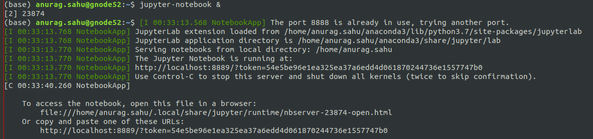
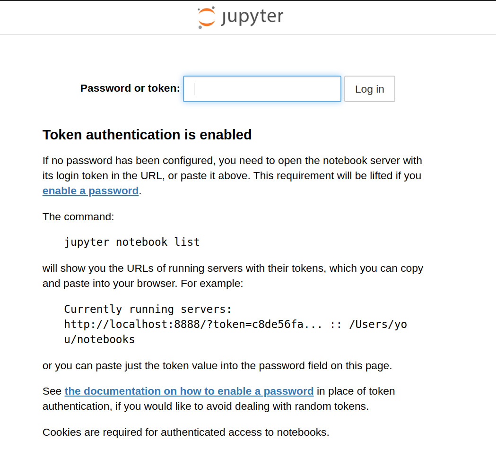

# jupyter-notebook-on-servers

Have you, like us all, ever been forced to use Colab even when you had credentials to a GPU server just because you didn't know how to run interactive python (.ipynb) notebooks on the server.
We all have tolerated the large uploading time and data requirements of colab simply because the jupyter-notebooks are elegant. But what if you had a way to run jupyter-notebook on your server?

### Install Anaconda
First you should have get the Anaconda Installer for Linux, you can go and download the installer file from the official Repository. And then ypu need to intall Anaconda<br>
The link gets updated from time to time you should check https://www.anaconda.com/products/individual#linux for updated links.
```
$ wget https://repo.anaconda.com/archive/Anaconda3-2020.02-Linux-x86_64.sh
$ bash ./Anaconda3-2020.02-Linux-x86_64.sh
```
### Make Conda environment

##### Only for ADA users

If you are working on ADA, before creating an environment, you must first get memory allocation from the server. For this we recommend getting an interactive sesion using salloc.
```
$ salloc -c 1 --gres=gpu:1 --time=1-00:00:00
```

The number of CPUs, GPUs and time can change according to your needs.
The output should be something like this,


In this case,I have been allocated ```gnode11```. SSH into allocated node, you can get a different gnode allocated, The node number is displayed on the last line of salloc, like ```salloc : Nodes gnode<nodenumber> are ready for job```.

```
$ ssh -X gnode11
```

Once, you have SSHed into the node, you can continue creating the conda environment.

##### For ADA and non-ADA users

Once you have memory allocated, create the conda environment,
```
conda create --name yourenv
```
```yourenv``` is the name of your environment.

Once the environment has been created, you can activate it using,
```
conda activate yourenv
```

### The Endgame: Starting the jupyter-notebook
##### Installing notebook

Install notebook to your conda environment using,
```
$ conda install -c conda-forge notebook
```

##### Running the notebook on the remote server

Once notebook has been installed to your conda environment, you can run jupyter-notebook in background on the server. <br>
Here ```&``` makes the process run in the background, This is necessary because we need to ssh the notebook into our local computer so dont ignore it.

```
$ jupyter-notebook &
```
The output to this should be something like,


Note that the notebook is running on port ```8889``` on the remote server, this might change everytime you run the command based on the availability of the ports.
Now, in order to open the notebook in the local machine's browser, you need the server's port on which the notebook is running, ```8889``` in this case, to talk to some port on the local machine. 
For this, you will need to SSH from the remote server to your local machine

```
$ ssh -N -f -R <P1>:localhost:<P2> username@your_ip
```

Where, ```<P1>``` is the port of the local machine on which you want to run the notebook, eg. ```8891```, and ```<P2>``` is the port of the server on which the notebook is currently running.

For example,
```
$ ssh -N -f -R 8891:localhost:8889 username@your_ip
```

```username``` is your username on local machine. One question that still remains is how to get ```your_ip```. For that run,
```
$ ifconfig
```

under ```tun0```, after ```inet``` you will see something like ```10.x.x.x```. This is ```your_ip```


##### Opening the notebook in the local browser
On your browser, type url,
```
localhost:<P1>
```
Where, ```<P1>``` is the same port as selected before.

If your browser opens a page like this,<br>
<br>

You will need to type in the token that you got when you did ```jupyter-notebook &```.
I the last line of the output of ```jupyter-notebook &``` you would have gotten something like,
```
    Or copy and paste one of these URLs:
        http://localhost:8889/?token=54e5be96e1ea325ea37a6edd4d061870244736e1557747b0
```

copy the token, in this case ```54e5be96e1ea325ea37a6edd4d061870244736e1557747b0```, and paste it in the space for token in the webpage.

Now, the jupyter-notebook should be open in your browser, and you can use it as if it was on your local machine, but it can only access the files on the remote server.

Happy coding!!!

~ Chaitanya Kharyal

~ Anurag Sahu
